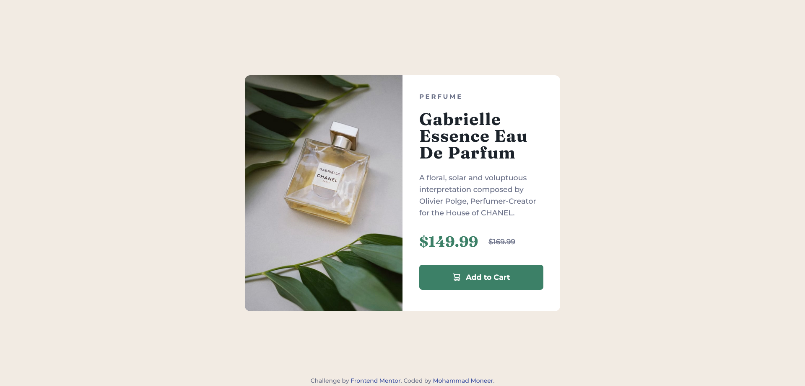

# Frontend Mentor - Product preview card component solution

This is a solution to the [Product preview card component challenge on Frontend Mentor](https://www.frontendmentor.io/challenges/product-preview-card-component-GO7UmttRfa). Frontend Mentor challenges help you improve your coding skills by building realistic projects. 

## Table of contents

- [Overview](#overview)
  - [Screenshot](#screenshot)
  - [Links](#links)
- [My process](#my-process)
  - [Built with](#built-with)
  - [What I learned](#what-i-learned)
- [Author](#author)

## Overview
To get some details and background of this project visit the link below:
[Frontend Mentor | Product preview card component coding challenge](https://www.frontendmentor.io/challenges/product-preview-card-component-GO7UmttRfa)

### Screenshot

### Links

- [GitHub Repository](https://github.com/Mohammad-Moneer/product-preview-card-component)
- [Live Demo](https://mohammad-moneer.github.io/product-preview-card-component/)

## My process

### Built with

- HTML
- CSS
- Flexbox

### What I learned

- Flexbox layout
- responsive images
changing the image displayed to suit different image display sizes.
- Adding an alternative descriptive element only for screen reader and make it invisible, and using aria-hidden to hide the original element from screen reader.

## Author

- Frontend Mentor - [@Mohammad-Moneer](https://www.frontendmentor.io/profile/Mohammad-Moneer)